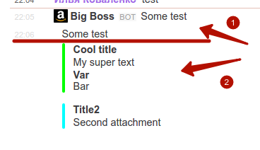

Try this...

Add you token in `console.php` and try this:

```
php composer.phar install
php console.php slack:send
```

Then change `composer.json` file and try my code:

```
cp composer_agentsib.json composer.json
php composer.phar update
php composer.php slack send
```

This is result:

